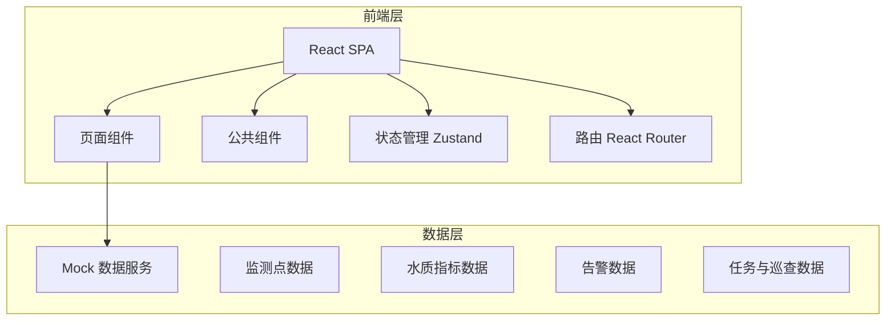
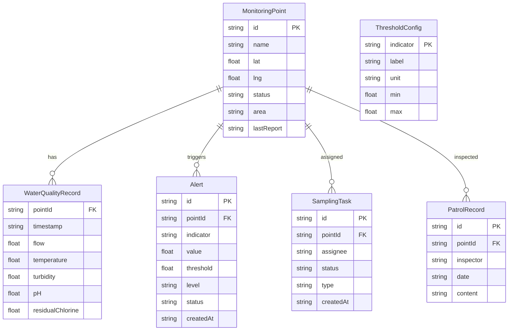

## 1. 架构设计



## 2. 技术说明

- 前端：React@18 + TypeScript + TailwindCSS@3 + Vite
- 初始化工具：vite-init
- 后端：无（纯前端，使用 Mock 数据）
- 数据库：无（使用内存 Mock 数据）
- 图表库：Recharts（指标曲线、统计图表）
- 地图：Leaflet + React-Leaflet（监测点地图）
- 状态管理：Zustand
- 路由：React Router DOM v6
- 图标：Lucide React
- 字体：Noto Sans SC + JetBrains Mono

## 3. 路由定义

| 路由 | 用途 |
|------|------|
| / | 首页总览，展示核心指标与告警摘要 |
| /map | 监测点地图，地图标注与保护范围 |
| /detail | 水质详情，指标曲线与数据表格 |
| /sampling | 取样任务，任务管理与表单录入 |
| /alerts | 告警中心，告警列表与阈值配置 |
| /patrol | 巡查记录，巡查表单与历史记录 |
| /reports | 统计报表，日报月报与台账导出 |

## 4. API定义

无后端API，使用前端 Mock 数据。在 `src/utils/mockData.ts` 中定义所有模拟数据结构：

```typescript
interface MonitoringPoint {
  id: string
  name: string
  location: { lat: number; lng: number }
  status: 'online' | 'offline' | 'alert'
  area: string
  lastReport: string
}

interface WaterQualityRecord {
  pointId: string
  timestamp: string
  flow: number
  temperature: number
  turbidity: number
  pH: number
  residualChlorine: number
}

interface Alert {
  id: string
  pointId: string
  pointName: string
  indicator: string
  value: number
  threshold: number
  level: 'critical' | 'warning' | 'info'
  status: 'pending' | 'processing' | 'resolved'
  createdAt: string
  resolvedAt?: string
  description: string
}

interface SamplingTask {
  id: string
  pointId: string
  pointName: string
  assignee: string
  status: 'pending' | 'in_progress' | 'completed'
  createdAt: string
  completedAt?: string
  results?: WaterQualityRecord
  photos?: string[]
  type: 'routine' | 'recheck'
}

interface PatrolRecord {
  id: string
  pointId: string
  pointName: string
  inspector: string
  date: string
  content: string
  issues: string
  photos: string[]
}

interface ThresholdConfig {
  indicator: string
  label: string
  unit: string
  min: number
  max: number
}
```

## 5. 服务端架构图

不适用（纯前端项目）

## 6. 数据模型

### 6.1 数据模型定义



### 6.2 数据定义语言

不适用（使用前端 Mock 数据，无数据库）
